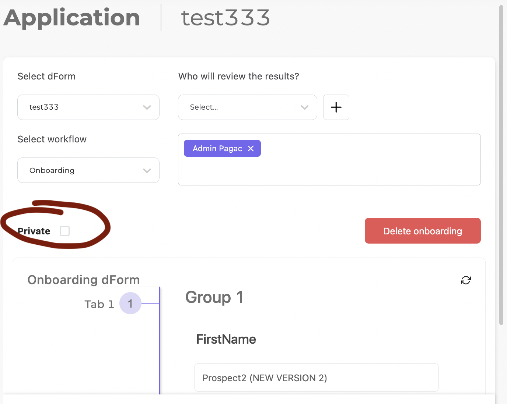
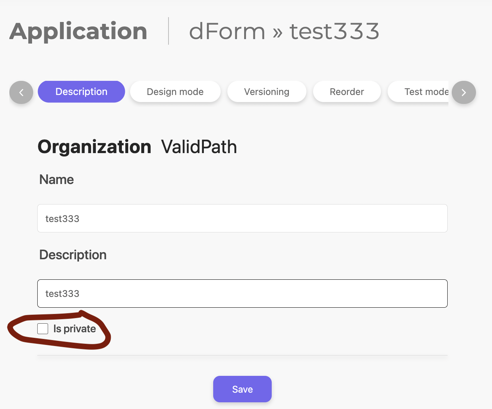
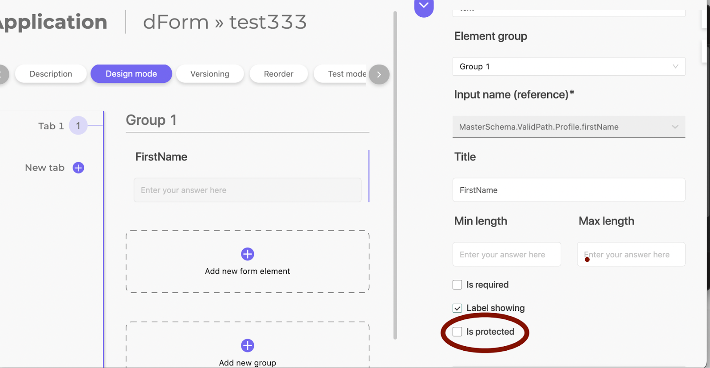
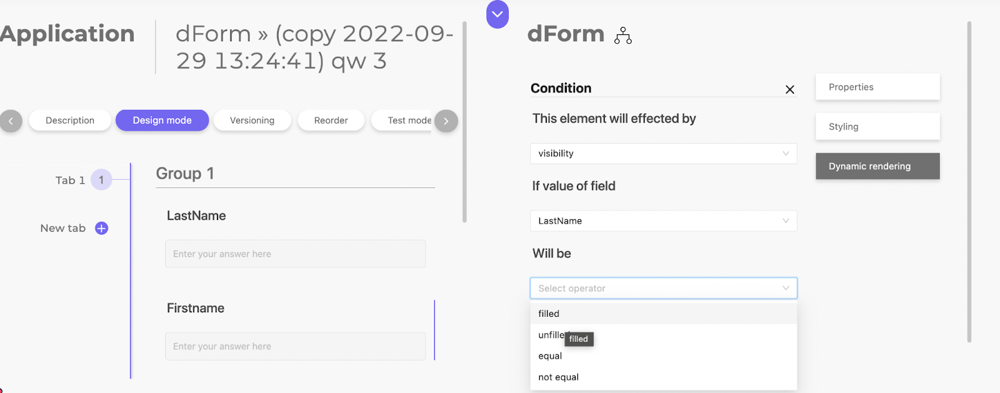

# Dynamic Forms (dForms)

NMP Dynamic Forms comprises innovation at both the software and infrastructure level, allowing the data capturing process to evolve with the business without requiring any IT support such as additional development, testing or upgrades.

This is a stark contrast to how many industry incumbents manage their data capturing process.
Data is captured through fragmented channels, either physically (ie paper forms) or through emails.
More advanced systems may collect data digitally through online forms,
As the business evolves, upgrades to these forms require developers to code up new forms which will also require backend connections, updates to database structures, and testing of all stages before deployment.
Data needs to be double handled and manually processed into a standard format by humans.

With NMP dForms, Administrators have full control over how they capture data, and can make edits whenever required.

Data is immediately stored in a highly effective, central repository called the MasterSchema
Every datapoint is version controlled, ensuring data integrity.

No development is required to support evolving business requirements, as new forms can be created, updated and deleted without requiring any development, testing or hardware updates.

### Case Study

A new business case required data to be collected about a new type of individual with significant differences in data points that required capturing. This required a brand new form to be created.

Historically, this scenario would be handled one of two ways:

- Physically (Turn around time: 2-3 days, with a high propensity for human error and double handling).

  - The Manager creates a Word document or PDF file and emails it to the individual.
  - The individual fills out the form online digitally or prints it out, fills it in, scans it back into the system and emails it back to the Manager.
  - The Manager would then have to migrate the feedback from the analogue form into a CRM like system for storage and processing by other staff.
  - Not a scalable solution

- Digital, where users access an online form, either from within a portal or otherwise:

  - The Manager creates a Word document or PDF file and requests the IT department for it to be developed,
  - The IT department would request a scoping exercise to develop a brief with requirements and all edge cases.
  - Development would require coding on the frontend, backend, security work and database updates, plus test cases will need to be created and managed.
  - Partly scalable but inflexible to change.

With NMP Dynamic Forms, which is currently in operation: (Turn around time: less than 1 hour)

- The Manager creates a dForm, applies it to the individual's profile and invites the individual to the system.
- The individual fills out the form online, where the data is already captured within the MasterSchema, from which the Manager and staff and process can access it from.
- Highly scalable and flexible to change.

## DForm Template field types

| type        | reference to master schema | reference to resource field |            configs             | Dynamic rendering |    data example    |
| :---------- | :------------------------: | :-------------------------: | :----------------------------: | :---------------: | :----------------: |
| text        |            yes             |             no              | minLength, maxLength, required |       todo        |       value        |
| date        |            yes             |             no              |            required            |       todo        |       value        |
| file        |            yes             |             no              |            required            |       todo        |       binary       |
| fileList    |            yes             |             no              |            required            |       todo        |      binary[]      |
| select      |            yes             |             no              |            required            |       todo        |       value        |
| multiSelect |            yes             |             no              |            required            |       todo        |     [`value`]      |
| number      |            yes             |             no              |            required            |       todo        |        111         |
| boolean     |            yes             |             no              |            required            |       todo        |        true        |
| longText    |            yes             |             no              | minLength, maxLength, required |       todo        | “
value
” |
| textArea    |            yes             |             no              | minLength, maxLength, required |       todo        |      “value"       |
| helpText    |            yes             |             no              |               -                |       todo        | “
value
” |
| resource    |            yes             |             yes             |         compileOptions         |       todo        |       binary       |

### Complex types

**Resource**

Resource is a compilable template that uses users value to compile a predefined template. A resource field depends on values of other fields.

The resource field has compile options, that option defines the flow how and when the resource should be compiled.

Currently, there is only one compile option which is “Compile on DForm association”.

The “Compile on DForm association” option sets up a flow when a DForm which has a resource field will compile all resources with associated user’s data when a DForm will be associated with that user.

There is a situation when the resource provided by dform’s field can be not actual if the compile option is “Compile on DForm association”. For example, when there is a dform that has a resource field and another field which the resource depends on. When the dependent field’s value changes, the resource does not re-compile automatically and contains only not actual data.

### “is private” or “is internal”

These are dForms that are not displayed in the "Member view" interface. If the dForm template is in a private state, then the dForm child cannot be public.

Member viewOnboarding dForm child\*\*

**DForm template**

### Protected fields, groups, sections

These are the fields, groups, sections that are not displayed in the "Member view" interface. This is what filters the backend and gives out only what is available.

### Dynamic rendering

This is a setting of some conditions for a field under which another field, group or section can be hidden or disabled

### How is data saved?

**Member view**
