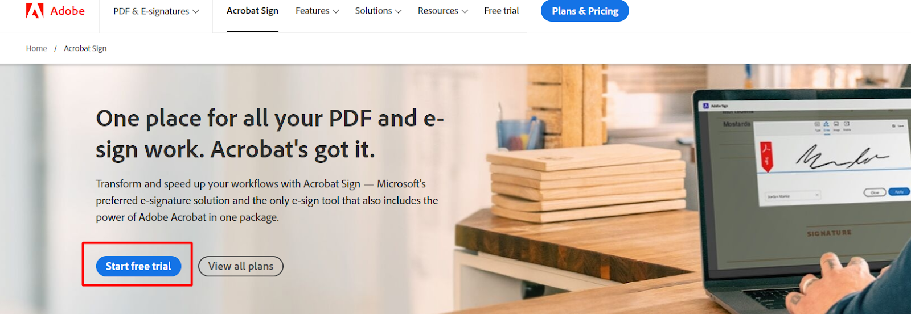
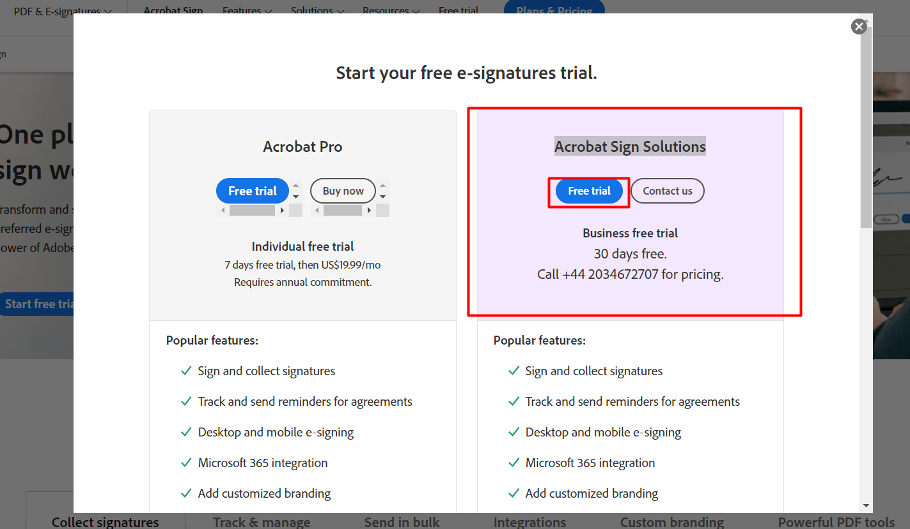
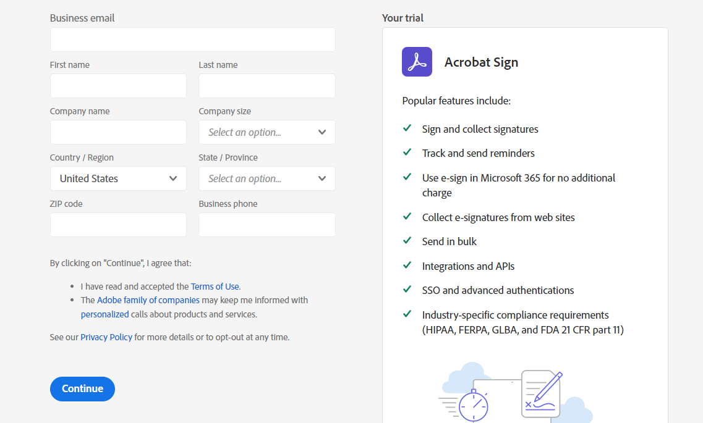
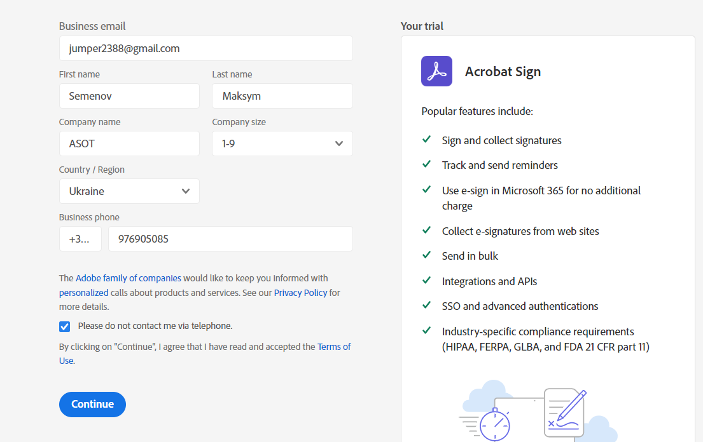
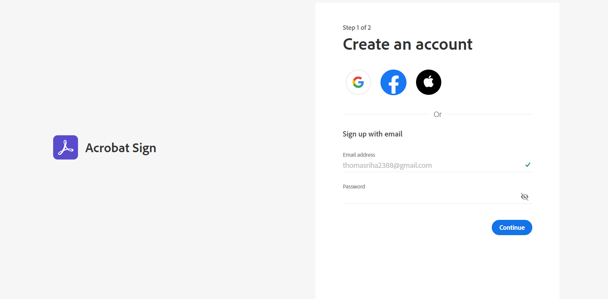
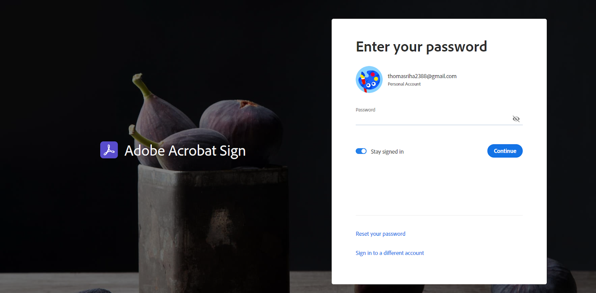
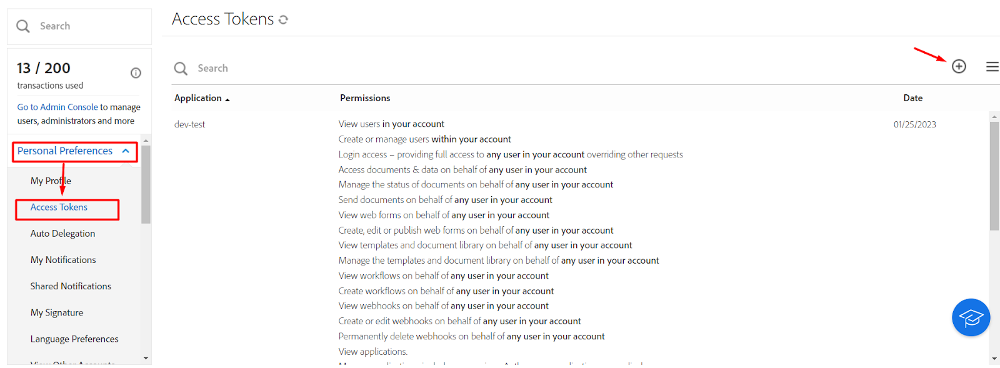
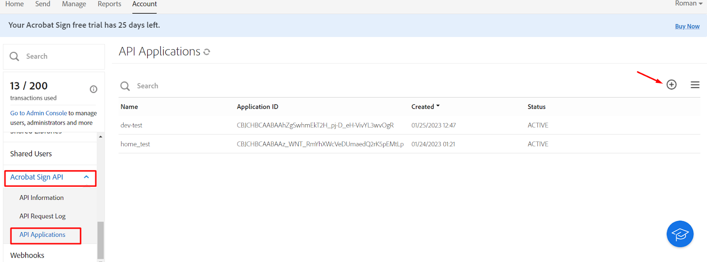

# How to create an account in Adobe Sign and Access Key

1. [Go to page](https://www.adobe.com/sign.html)
2. Click the button **Start free trial**
   
3. Choose column **Acrobat Sign Solutions** and click button **free trial**
   
4. You can see this page
   
5. Fill in the fields as in this example
   
6. After registration, you will be redirected to this page, here you need to generate a random password
   
7. When you generate a new password and click continue, you will redirect to this page
   
8. Click in Account Tab and create Access Token
   
9. Then you have to create Api Application
   
