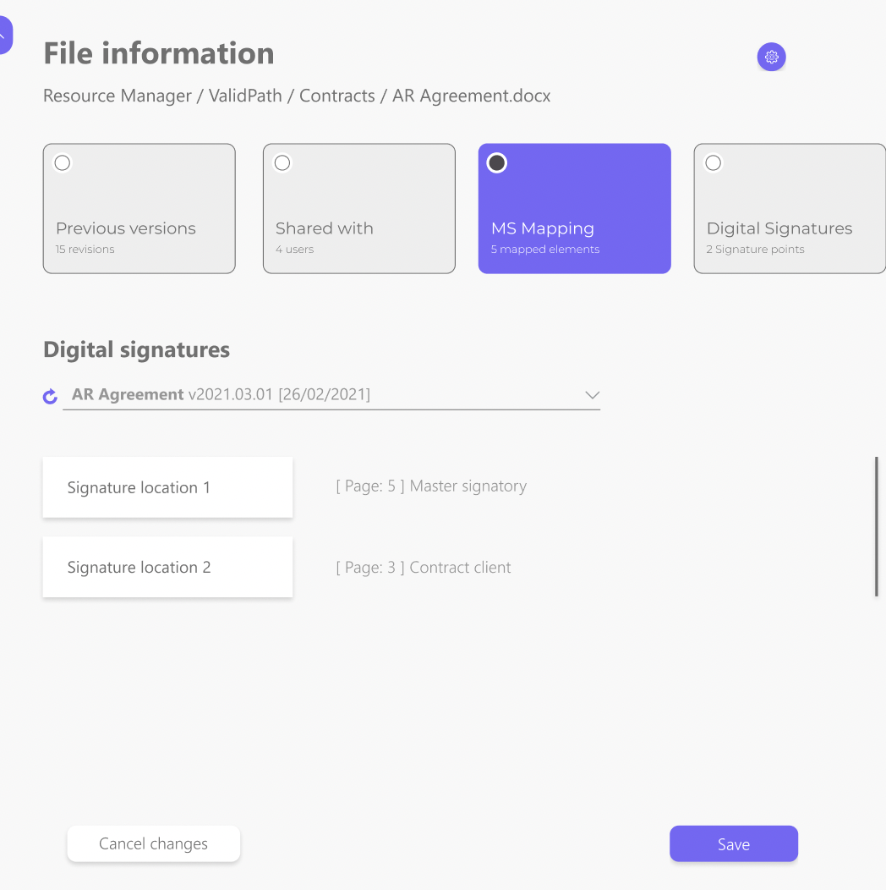
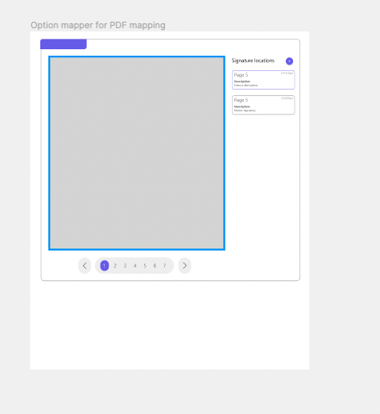
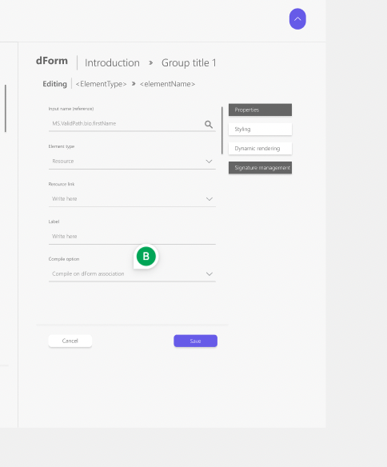

# Digital Signature

Digital Signature it is one of powerful project tools. The manager have opportunity to look out needed documents and also sign up them in digital way.

### How it works

For a digital signature, the manager must complete the following steps.

1. Uploads PDF or Word document to [Resource Manager (RM)](./../resource_manager/index.md)
2. Match all required fields with available options
   
3. Activate the digital signature on the RM file
4. Configure digital signature requirements
5. The PDF is created and converted to JPEG and shown to the manager so the manager can draw a box where the captions
   
6. In signature management, the manager chooses the user with signature locations in a PDF, PDF is sent to Adobe which will create areas for sign
   
7. The PDF file is sent to Adobe for conversion to a temporary file

### Presetting

- [Acrobat SignApi Doc](https://secure.eu2.adobesign.com/public/docs/restapi/v6)
- [How to create an account in Adobe and Access Token](./adobe_sign-account/index.md)
- [How to work with Sandbox Adobe Sign](./sandbox_adobe_sign/index.md)
- [How to create webhooks in Adobe Sign](https://medium.com/@adobesignwebhook/adobe-sign-webhook-7adb40be7822)
- Adobe Sign Account:

  - jetbrainsroman2388@gmail.com `rCviv6dDC)11`
  - thomasriha2388@gmail.com `BHrv52HLwAytzF4t)`

- Gmail Account

  - jetbrainsroman2388@gmail.com `4kmZ7Cqn`
  - thomasriha2388@gmail.com `4kmZ7Cqn`

- Libraries

  - [Convert PDF to JPG: Imagick PHP library (for converting PDF to jpg)](https://www.itsolutionstuff.com/post/laravel-convert-pdf-to-image-exampleexample.html)
  - [Convert Word document to PDF](https://github.com/mnvx/lowrapper)

- Useful data
  - `ACROBAT_SIGN_API_ACCESS_TOKEN = 3AAABLblqZhAPuJj7mLiFnyX6MOOhFoLkkyW4NH45vzPbM7CGro-HIxVWDy2aw5ufLVXtTHBo4FqbRK-kicZ3TedH96GZ4HM5`
  - `X_HEADER_ADOBE_SIGN_CLIENT_ID = UB7E5BXCXY`
  - `X_ADOBE_SIGN_CLIENT_ID = CBJCHBCAABAAz_WNT_RmYhXWcVeDUmaedQ2rK5pEMtLp`

[Implementation with NMP](../../development/backend/project/digital_signature/implementation_nmp/index.md)
