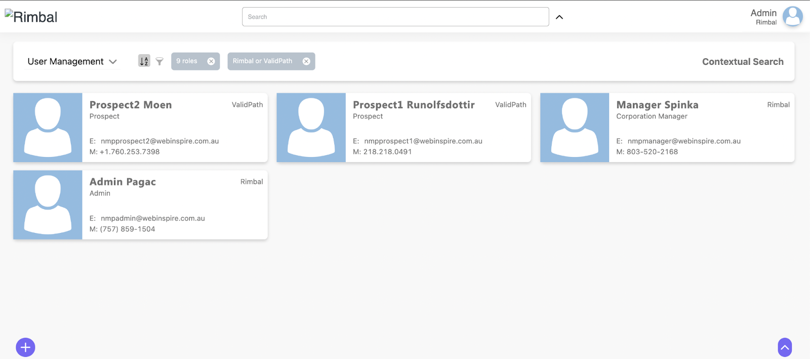
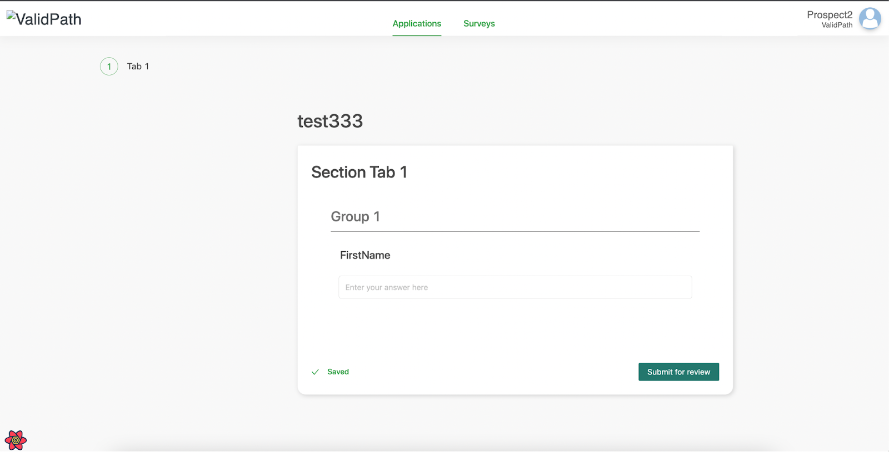

# Project description

The project refers to the onboarding process of advisers with their selected providers. On average, each adviser onboards approximately 10 to 15 providers, with some Member Firms requiring over 50 providers per Member, with each provider requesting different supporting documentation, along with their own application form. Historically, this onboarding process has been managed via PDFs and email.

This process presents significant challenges, even before considering the scaling of the process. Some of these challenges are:

- Ensuring all the data has been collected from Members, a process which results in additional manual work and double handling of data.

- Increased communication required between Managers and Members which can lead to errors, security vulnerabilities and delay.

- Double handling of data as already captured data then needs to be pre populated into provider specific application forms.

- Managing the communication with providers per Member submitted and ensuring all Members are progressing through the process without unnecessary delay.

Due to NMP’s advanced approach to data collection and management, a significant portion of the data collection and preparation process has already been optimised, through features such as Dynamic forms, the MasterSchema and Resource Manager.

Agency Management further builds on these features by providing additional features specific to provider management, with regard to automated pre-populating of provider applications forms, and pre-collation of supporting documents, while requiring minimal human intervention.

Furthermore, due to the powerful auditing capabilities of NMP, NMP’s Agency Management feature will be able to report on the completeness of each application and track the progress of each submission with providers.

## The project is divided into two interfaces: "Member view" and "Manager View"

### Manager view

Roles:

- Admin
- Corporation manager
- Network manager
- BDM

### Member view

Roles:

- Prospect
- Member

[Next page. Go to user documentation](./user/index.md)

[Here's a style guide to creating documentation.](../index.md)
