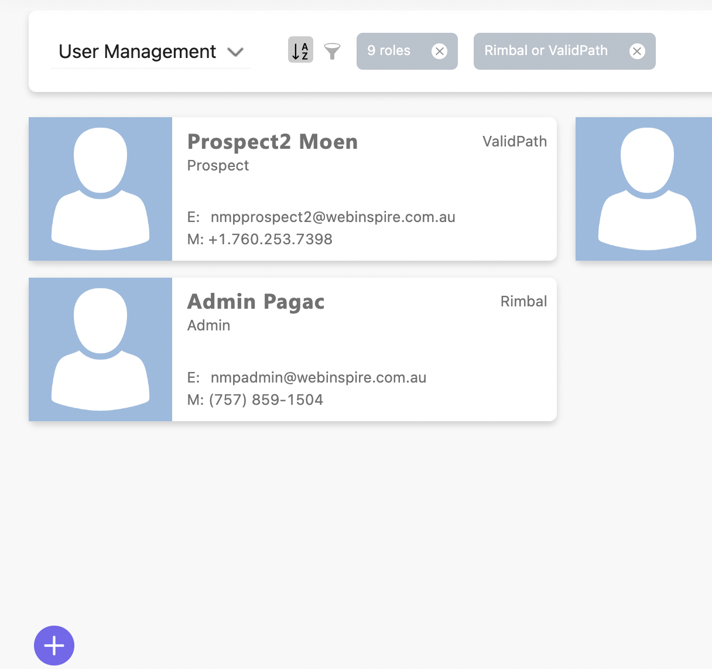
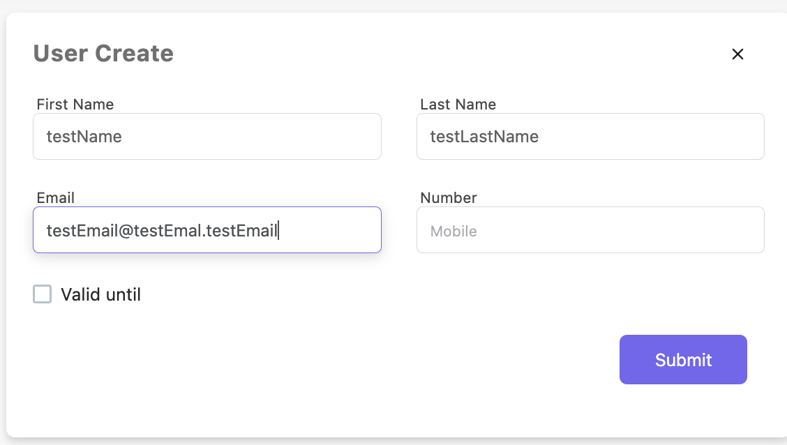
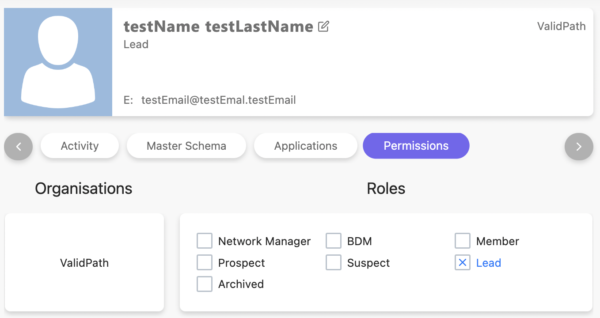

### User creation

1. To create a new user open “User management” page and click on the plus icon

2. Fill required data and click on “Submit”

Required fields:

- first name
- last name
- email

User will be created with default permission “Lead”

[Next: Invitation](../invitation/index.md)
