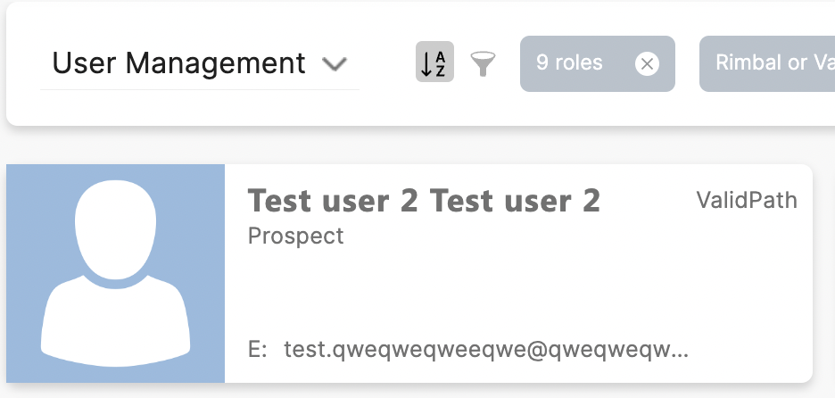
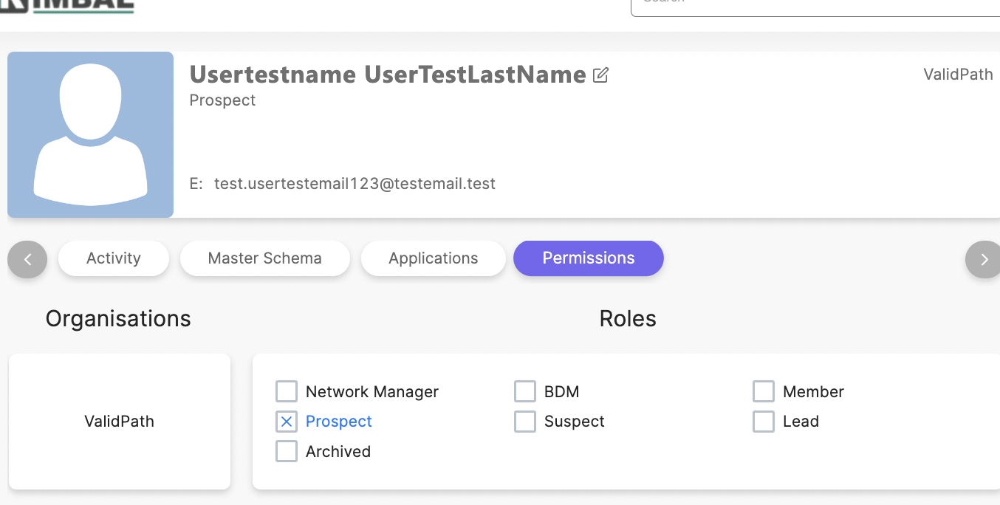
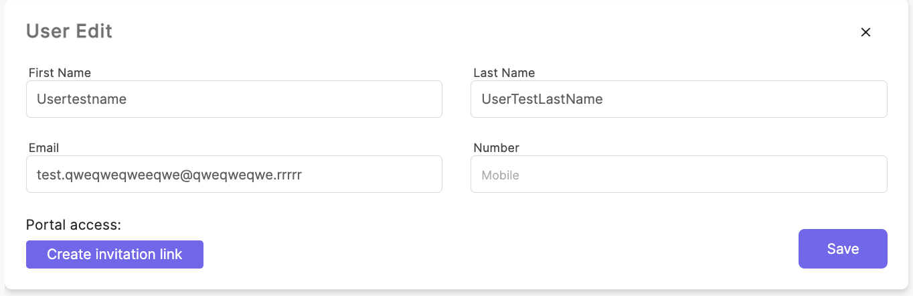
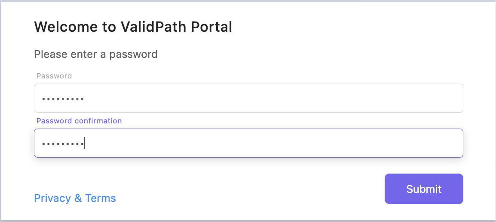

### Create invitation

#### Description

Guest invite will allow Managers to temporarily invite a guest into the system to provide specific data to supplement a Members profile. An example of this would be a reference provider providing specific information about a Members past experience. This ‘Reference Provider’ would be granted access to the system as a Guest, and will have temporary, limited access in which they submit the requested information.

In order to grant access to the system, you must invite the user

1. Open “User management” and click on a user card

2. When you opened the user card, then click on square badge (user edit) right of user name

What roles can invite?

- Prospect
- Member
- BDM
- Network manager
- Corporation manager

3. Click on “Create invitation link”

4. Next you will see “Copy link” this is a link where you can go and make a new password for the user and log in to the system

- You can send link to user by email
- Copy link
- Delete invitation

The form that the user sees by clicking on the invitation link

[Next: Member firm](../../member_firm/index.md)
