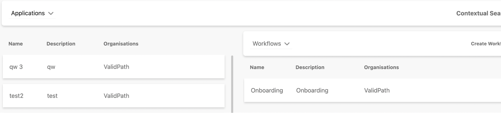
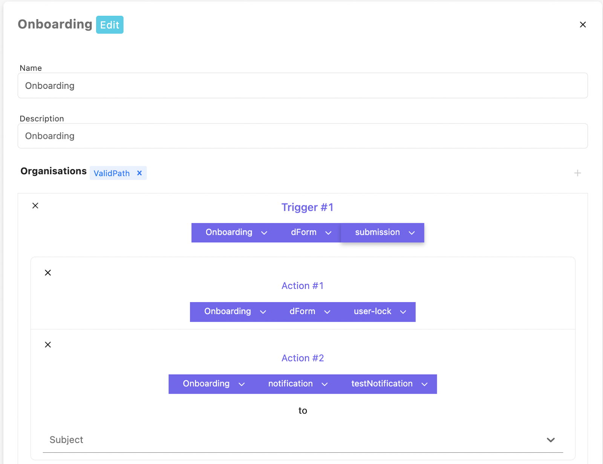
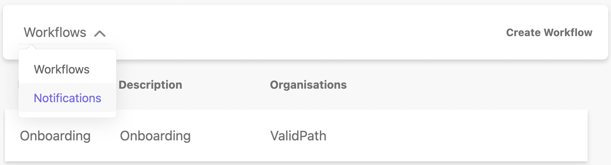
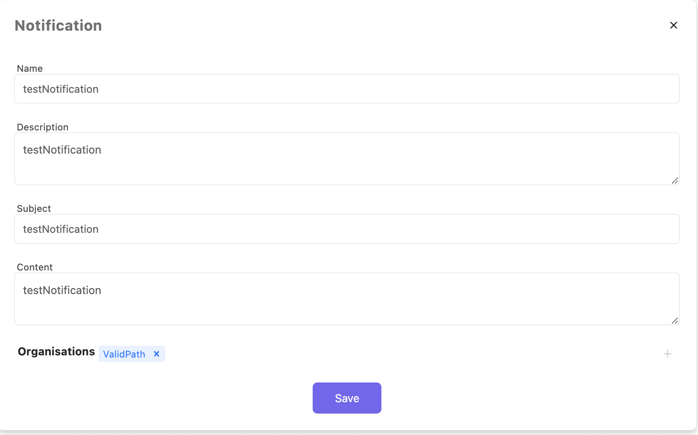

# Workflows

Workflows enable Administrators to define how NMP behaves under certain circumstances with a high degree of fidelity and customization. This allows NMP features such as dForms to be further adaptable to evolving business needs.

Examples include, controlling what happens to a dForm once a user submits it. Workflows allows the administrator to define everything from what to do with the dForm ie lock it, to the cascading notifications that need to be sent to different users who need to be informed and should take action.

Historically, these functions would be hard coded meaning that updating a process would require the involvement of the IT department, naturally leading to expanded costs and timelines for somewhat minor updates.

NMP Surveys follows the same paradigm of Dynamic Forms, in that Surveys can be designed by the Managers, as well as also being plugged into workflows so Managers have full control over how NMP reacts to user inputs and state changes over time.

Further, Survey questions are version controlled so that Surveys can evolve over time without affecting the integrity of historically conducted Surveys.

Digitizing this process saves time with regard to marking and recording the results of the survey, as well as making it easier to keep the Surveys up to date.

### How it works?

The manager can set up triggers that will be related to the state change and specify the actions that will be performed

Blocking from editing "user-lock" and send some kind of notification to the end user "Subject"

In order to create a notification template, you need to go to the notification section

Next, you can create a notification template and use it in the workflow, as long as they belong to the same organization

